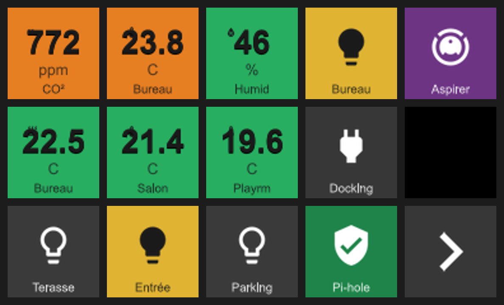
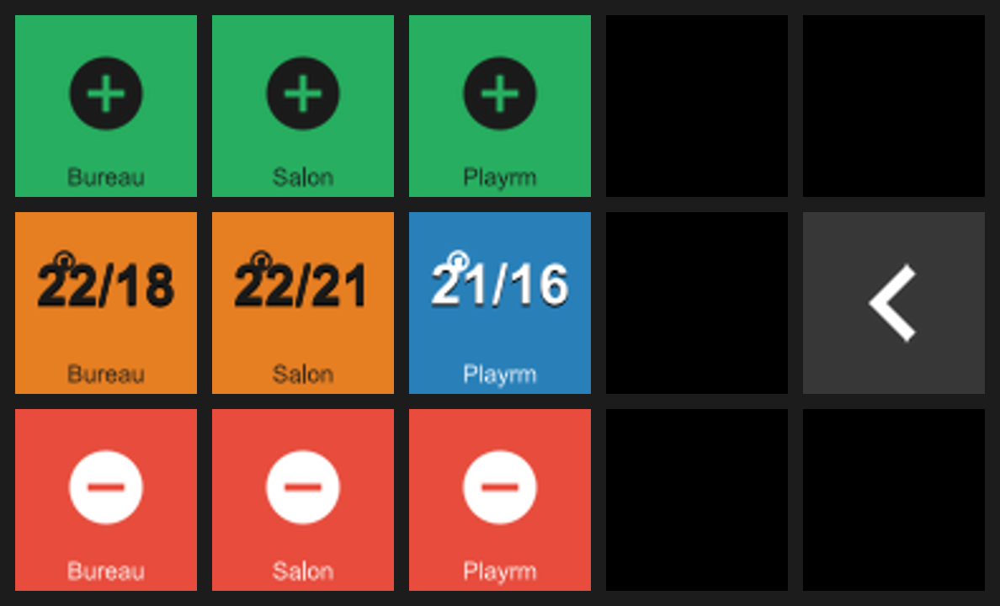

# Stream Deck Pilot — API Guide

This service is designed to be driven by Claude Code or scripts. All endpoints accept and return JSON. The OpenAPI schema is always available at `GET /openapi.json` (no auth required).

---

## Authentication

Every endpoint except `/health` and `/openapi.json` requires:

```
X-Api-Key: <value of the API_KEY environment variable>
```

Missing or wrong key → `401 Unauthorized`.

---

## Mental model

```
Device catalogue (app-owned, read-only via API)
  └─ DeviceEntry  serial, model, key geometry, first/last seen
        └─ DeviceConfig  (one per serial, API-managed, schemaVersion 2)
              └─ Page[]  (type discriminator: "ButtonGrid")
                    └─ ButtonDefinition[]
                          ├─ Display      icon + iconPlacement + Center/Bottom text zones
                          ├─ Inbound      MQTT topic, field extraction, staleness
                          ├─ Rules[]      ordered conditions → colour/icon override
                          └─ Gestures     "Tap" → [PublishAction | NavigateAction]
```

**Key rules:**
- You cannot write config for a serial that isn't in the catalogue. The device must have been physically connected at least once.
- Key positions (`keyIndex`) are 0-based, left-to-right, top-to-bottom. MK.2 = 0–14 (5 cols × 3 rows).
- All config writes are validated before persisting. Errors return `400` with an `errors` array.
- **Rendering is what you declare, not what the data is.** The layout follows the zones you fill and the icon placement you choose — the service never infers a layout from the *kind* of data a tile carries.

---

## Display model (the important part)

A tile is composed from an optional icon plus two **text zones**. You decide what goes where; the service does not guess.

```jsonc
"display": {
  "baseIcon": "builtin:thermometer",   // "builtin:<mdi-name>" | "custom:<filename>" | null
  "iconPlacement": "corner",           // "corner" | "center"   (see below)
  "center": { "label": null,  "template": "{value} {unit}" },   // large hero text
  "bottom": { "label": "Bureau", "template": null }             // small bottom caption
}
```

### Text zones — `center` and `bottom`

Each zone has two fields:

- **`template`** — resolved against live MQTT data using the tokens `{value}`, `{unit}`, `{label}`.
- **`label`** — static text, rendered as-is.

Resolution rule per zone:

1. If `template` is set **and** the button has received live MQTT data → the template is filled and shown.
2. Otherwise the static `label` is shown (the fallback — there's nothing to resolve against yet).
3. A zone with only a `label` always shows that label.

This means a sensor tile shows its static caption immediately on connect and swaps the hero to live data once a message arrives — no separate placeholder needed.

Positional styling:
- **`center`** renders **large, centred** — the hero. Its text is split on the first space: the head renders big, the tail renders small beneath it as a unit. So `"{value} {unit}"` → big `23.5`, small `°C`.
- **`bottom`** renders as a **small caption** along the bottom (e.g. a room name).

### `iconPlacement`

- **`corner`** — small icon, top-left. Use when a value in `center` is the hero (sensor tiles). This is the default if the field is omitted.
- **`center`** — large, centred icon (the hero). Use for toggle / navigation / status tiles. If `center` text is also present, the **text wins** and the icon is not drawn.

### Icons

- `builtin:<mdi-name>` resolves any [Material Design Icons](https://pictogrammers.com/library/mdi/) glyph by name (e.g. `builtin:thermometer`, `builtin:molecule-co2`, `builtin:lightbulb`, `builtin:chevron-right`). The glyph is drawn transparent and tinted to an automatically-chosen ink colour (light or dark) for contrast against the tile background — you never set text/icon colour.
- `custom:<filename>` references an icon you uploaded via `POST /devices/{serial}/images`.
- A small set of legacy generated tokens (`co2`, `thermometer`, `humidity`, `power`, `arrow-left`, `arrow-right`, `placeholder`, `fallback`) remain as a fallback when an MDI name is not found. Prefer MDI names. See `docs/icon-vocabulary.md`.

---

## What the tiles look like

Rendered by the actual `KeyBitmapComposer` (pixel-accurate to the hardware) — the live homelab
layout, `main` dashboard and `climate` page:





Generated headlessly by `tools/StreamDeckPreview` from a device config; see that tool's README
to regenerate or to preview your own config without a physical deck.

---

## Endpoints

### `GET /devices`
List the device catalogue with current connection state.

```jsonc
// Response 200
[
  {
    "serial": "A7FZA5191LB60S",
    "model": "Stream Deck MK.2 (Scissor Switch)",
    "keyRows": 3,
    "keyColumns": 5,
    "firstSeen": "2026-06-05T10:00:00Z",
    "lastSeen": "2026-06-05T12:00:00Z",
    "connectionState": "Connected"   // Unknown | Disconnected | Connecting | Connected | Faulted
  }
]
```

### `GET /devices/{serial}/status`
Connection state for one device. `404` if serial not in catalogue.

### `GET /devices/{serial}/config`
Current persisted config. `404` if no config written yet.

### `PUT /devices/{serial}/config`
Write (replace) the full config for a device. Validated before save. The body must be at the current schema version (`2`); use `POST /config/upgrade` first if you hold an older config.

```jsonc
// Request body — DeviceConfig
{
  "schemaVersion": 2,
  "serial": "A7FZA5191LB60S",
  "pages": [
    {
      "pageType": "ButtonGrid",
      "pageId": "main",
      "buttons": [ /* ButtonDefinition[] — see below */ ]
    }
  ]
}
// Response 204 No Content on success
// Response 400 { "errors": ["..."] } on validation failure
```

### `POST /config/upgrade`
Migrate a config JSON from any supported schema version to the current version. Does **not** persist. Use this to bring a stored v1 config up to v2 before re-writing it.

```jsonc
// Request: any DeviceConfig JSON (any supported schemaVersion)
// Response 200: same config at current schemaVersion (2)
// Response 422: { "error": "unsupported_schema_version", "message": "..." }
```

### `GET /devices/{serial}/active-page`
Which page the device is currently showing, plus the available navigation targets. `404` if no config.

```jsonc
// Response 200
{
  "serial": "A7FZA5191LB60S",
  "activePageId": "main",
  "connected": true,
  "availablePages": ["main", "climate", "lights"]
}
```

### `POST /devices/{serial}/navigate`
Force navigation to a page without publishing an MQTT `Navigate` action — handy for testing layouts. Re-renders the whole board (so keys not bound on the target page are cleared).

```jsonc
// Request body
{ "pageId": "climate" }
// Response 200 { "serial": "...", "activePageId": "climate", "rendered": true }
//   rendered=false → page set but device offline; it will render on next connect
// Response 400 { "message": "...", "availablePages": [...] }  // unknown/empty pageId
// Response 404  // no config for this device
```

### `POST /devices/{serial}/force-render`
Re-renders all keys from desired state (current page). Useful after manually editing config on disk.

### `POST /devices/{serial}/images`
Upload a custom icon (PNG or JPEG, max 512 KB). `multipart/form-data`.

```
Response 200: { "ref": "custom:my-icon.png" }
```

Use `"ref"` as `display.baseIcon` in a `ButtonDefinition`.

### `GET /devices/{serial}/images` / `DELETE /devices/{serial}/images/{filename}`
List or remove custom icons.

### `GET /openapi.json`
Full OpenAPI 3 schema (no auth required).

---

## ButtonDefinition schema

```jsonc
{
  "buttonId": "office-co2",          // stable human-readable ID
  "keyIndex": 0,                     // 0-based, within page
  "pageId": "main",

  "display": {
    "baseIcon": "builtin:molecule-co2",  // "builtin:<mdi-name>" | "custom:<filename>" | null
    "iconPlacement": "corner",           // "corner" (small, top-left) | "center" (large hero)
    "center": { "label": null,  "template": "{value} {unit}" },  // large hero text
    "bottom": { "label": "CO₂",  "template": null }              // small caption
  },

  "inbound": {                       // null for press-only buttons
    "topic": "home/office/co2",
    "valueField": "value",           // JSON path-lite: "value" or "sensor.value"
    "unitField": "unit",
    "labelField": null,              // optional: extracts a live string for the {label} token
    "expectsRetained": true,         // shows a dimmed placeholder until first value arrives
    "stalenessTimeout": "00:00:30"   // TimeSpan; null = never goes stale
  },

  "rules": [                         // ordered, first-match-wins, over the extracted NUMERIC value
    { "condition": ">1000", "backgroundColour": "#FF0000", "icon": null },
    { "condition": ">800",  "backgroundColour": "#FF8800", "icon": null },
    { "condition": ">=0",   "backgroundColour": "#00AA00", "icon": null }
  ],
  // condition grammar: ">N" ">=N" "<N" "<=N" "==N" "between:A:B"
  // Conditions are NUMERIC ONLY. A non-numeric payload (e.g. "on"/"cleaning") matches no rule,
  // so state-driven colour/icon needs a numeric payload (e.g. 1/0). A matched rule's "icon"
  // overrides display.baseIcon for that render.

  "gestures": {
    "Tap": [
      { "type": "Publish", "topic": "home/ventilation/toggle", "payload": "true" },
      { "type": "Navigate", "targetPageId": "menu" }
      // actions execute in order, fire-and-forget
    ]
  }
}
```

### Tile recipes

| Tile | iconPlacement | center | bottom |
|------|---------------|--------|--------|
| Sensor (value hero) | `corner` | `{ template: "{value} {unit}" }` | `{ label: "Bureau" }` |
| Climate (cur/tgt) | `corner` | `{ template: "{label}" }` (live `"22/18"`) | `{ label: "Salon" }` |
| Toggle / status | `center` | — | `{ label: "Lampe" }` |
| Navigation arrow | `center` | — | — |

> Climate note: a `{label}` hero must have **no internal space** (`"22/18"`, not `"22 / 18"`), because the center text is split on the first space to separate the unit. Round to integers to keep it narrow on a 72 px key.

---

## MQTT conventions

**Inbound (sensor → button):**
Preferred payload shape: `{"value": 1023, "unit": "ppm", "ts": "2026-06-05T12:00:00Z"}`.
Add a `label` field (and point `inbound.labelField` at it) when you want a live string in the `{label}` token, e.g. `{"value": 22.0, "label": "22/18"}`.
Bare numeric strings also work (`"1023"`), but self-describing JSON is preferred.
Publishers should set the **retain** flag so the app populates immediately on start.

**Outbound (button press → broker):**
`PublishAction.payload` is emitted verbatim. Choose a stable payload per button (e.g. `"true"`, `"toggle"`, or a JSON string).

---

## Worked example: configure a CO₂ monitor button

```bash
# 1. Discover what's connected
curl -H "X-Api-Key: $API_KEY" http://streamdeck.local/devices

# 2. Write a config: a CO₂ sensor tile on key 0 (value hero + room caption)
#    and a nav arrow on key 14.
curl -X PUT \
  -H "X-Api-Key: $API_KEY" \
  -H "Content-Type: application/json" \
  -d '{
    "schemaVersion": 2,
    "serial": "A7FZA5191LB60S",
    "pages": [{
      "pageType": "ButtonGrid",
      "pageId": "main",
      "buttons": [
        {
          "buttonId": "co2",
          "keyIndex": 0,
          "pageId": "main",
          "display": {
            "baseIcon": "builtin:molecule-co2",
            "iconPlacement": "corner",
            "center": { "template": "{value} {unit}" },
            "bottom": { "label": "Bureau" }
          },
          "inbound": { "topic": "home/office/co2", "valueField": "value", "unitField": "unit", "expectsRetained": true, "stalenessTimeout": "00:01:00" },
          "rules": [
            { "condition": ">1000", "backgroundColour": "#E74C3C", "icon": null },
            { "condition": ">700",  "backgroundColour": "#E67E22", "icon": null },
            { "condition": ">=0",   "backgroundColour": "#27AE60", "icon": null }
          ],
          "gestures": {}
        },
        {
          "buttonId": "to-climate",
          "keyIndex": 14,
          "pageId": "main",
          "display": { "baseIcon": "builtin:chevron-right", "iconPlacement": "center" },
          "rules": [],
          "gestures": { "Tap": [ { "type": "Navigate", "targetPageId": "climate" } ] }
        }
      ]
    }]
  }' \
  http://streamdeck.local/devices/A7FZA5191LB60S/config

# 3. Force a re-render immediately
curl -X POST -H "X-Api-Key: $API_KEY" \
  http://streamdeck.local/devices/A7FZA5191LB60S/force-render

# 4. Verify MQTT is updating the button — publish a test value
mosquitto_pub -h rabbitmq.local -u $MQTT_USER -P $MQTT_PASS \
  -r -t home/office/co2 -m '{"value":850,"unit":"ppm"}'
```

---

## Schema versions & migration

- Configs carry a `schemaVersion`. The current version is **2**.
- Stored configs below current are migrated **automatically on load**, and on demand via `POST /config/upgrade`. Below the minimum supported version → `422`.
- **v1 → v2** mapping (for reference — happens automatically):
  - `display.formatTemplate` → `display.center.template`
  - `display.staticLabel` → `display.bottom.label`
  - `display.baseIcon` → unchanged
  - `display.iconPlacement` → `"corner"` if the tile had a `formatTemplate` (was a sensor), else `"center"` — reproducing the v1 look exactly.

---

## Error reference

| Code | Meaning |
|------|---------|
| 401 | Missing or wrong `X-Api-Key` |
| 400 | Validation error (`errors` array), or bad/unknown `pageId` on navigate |
| 404 | Serial not in catalogue, or no config for that serial |
| 422 | Schema version too old for `POST /config/upgrade` |
| 204 | Config saved successfully (`PUT /devices/.../config`) |
